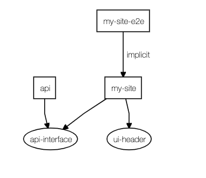

# NxHello

This project was generated using [Nx](https://nx.dev).

## Goal

- first contact with the tool

## Documentation

- [Nx](docs/nx.md)

- [Project creation commands (steps)](docs/project-creation-commands.md)

## Project dependency graph

## Findings

- the projects are expected to use the TypeScript language
  the shared code from the application, they're placed on the `libs` directory

- the applications, they're placed on the `apps` directory
  it offers support to have a node.js application, that could be used as the API

- it's possible to have libs as Web Components, React stuff, Angular Stuff or plain TypeScript code

- it's possible to have frontend apps using Angular or React

- it's possible to deploy a react lib to the NPM ([Publishing React Libraries Made Easy | Nrwl](https://blog.nrwl.io/publishing-react-libraries-made-easy-d5b3d013deba))

- [Storybook](https://storybook.js.org/) - [Nx support](https://nx.dev/react/guides/modernize-storybook-react)

  - [Storybook support, run-many command, UI improvements, and more in Nx 8.8 | Nrwl](https://blog.nrwl.io/storybook-support-run-many-command-ui-improvements-and-more-in-nx-8-8-90575cb5dda4)

  - [Nx 8.8: Now You Can Write UI Tests with Storybook and Cypress | Nrwl](https://blog.nrwl.io/ui-testing-with-storybook-and-nx-4b86975224c)

- [Support for generic task execution, displaying affecting projects, new commands for schematics discovery, and more in Nx 8.7 | Nrwl](https://blog.nrwl.io/support-for-generic-task-execution-displaying-affecting-libraries-new-commands-for-schematics-1b62b444ad0e)

  - [[GitHub] nrwl/nx-azure-build](https://github.com/nrwl/nx-azure-build) - Example of setting up distributed Azure build for Nx workspace

  - [Build Affected Apps | Nx Docs](https://nx.dev/react/tutorial/11-build-affected-projects)

  - [Moving your Azure DevOps build pipelines to your code repository](https://blog.bredvid.no/moving-your-azure-devops-build-pipelines-to-your-code-repository-dff60488c0f9)

  - [Azure DevOps YAML build for Mono Repository with multiple projects](https://dev.to/nikolicbojan/azure-devops-yaml-build-for-mono-repository-with-multiple-projects-146g) - project example at [[GitHub] nikolic-bojan/azure-yaml-build](https://github.com/nikolic-bojan/azure-yaml-build)

- [Powering Up React Development With Nx | Nrwl](https://blog.nrwl.io/powering-up-react-development-with-nx-cf0a9385dbec)

- [React Microfrontends and Monorepos: A Perfect Match | Nrwl](https://blog.nrwl.io/monorepos-and-react-microfrontends-a-perfect-match-d49dca64489a) - [demo](https://nrwl-nx-examples-cart.netlify.com/cart) | [code](https://github.com/nrwl/nx-examples)

## Known issues on MacOS

- [How to fix the Node gyp Error: No Xcode or CLT version detected | Reactgo](https://reactgo.com/gyp-xcode-or-clt-version-detected/)
